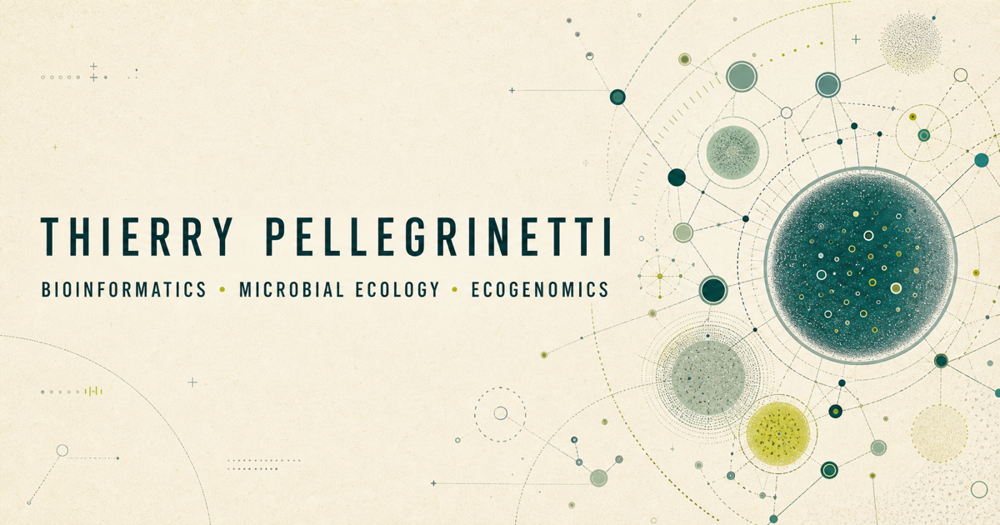

# Thierry Pellegrinetti — academic portfolio

[](https://tpellegrinetti.github.io/)



Personal research website for Thierry Alexandre Pellegrinetti, a bioinformatician and microbial ecologist working across genome-resolved metagenomics, host–microbiome systems, environmental microbiology, and scientific software.

## What is here

- An editorial homepage introducing the research programme and selected work.
- A curated publication record with DOI and indexing links.
- Accessible research notes translating methodological questions into ecological meaning.
- Academic profile links for Google Scholar, ORCID, Lattes, LinkedIn, and GitHub.
- Responsive light and dark themes, semantic HTML, keyboard-friendly navigation, and reduced-motion support.
- Search and social metadata, including a custom Open Graph image.

## Main content

| Area | Source |
| --- | --- |
| Homepage | `_pages/about.md` |
| Publications | `_pages/publications.html` |
| Research notes index | `_pages/research-notes.html` |
| Long-form notes | `_posts/` |
| Visual system | `_sass/_custom.scss` |
| Profile and SEO settings | `_config.yml` |
| Navigation | `_data/navigation.yml` |

## Run locally

The site uses Jekyll and is deployed through GitHub Pages.

```bash
bundle install
bundle exec jekyll serve
```

Then open `http://localhost:4000`.

To run the same production-style validation used before publishing:

```bash
bundle exec jekyll build
```

## Updating publications

Edit `_pages/publications.html`, keeping the newest year first. Use DOI links as the canonical article destination and keep the complete citation record on Google Scholar rather than copying volatile citation metrics into the site.

## Research identity

- [Google Scholar](https://scholar.google.com/citations?user=OZYSiosAAAAJ&hl=pt-BR&oi=ao)
- [ORCID 0000-0001-9386-6273](https://orcid.org/0000-0001-9386-6273)
- [Lattes CV](http://lattes.cnpq.br/3793742234896496)
- [LinkedIn](https://www.linkedin.com/in/thierry-pellegrinetti/)

## Foundation

The site retains the Jekyll structure of [Academic Pages](https://academicpages.github.io/) and Minimal Mistakes under the repository's MIT license, with a custom content model and visual identity built for this research portfolio.
